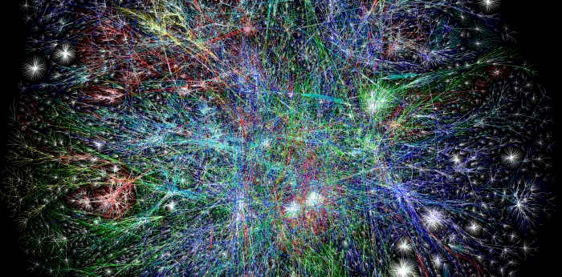

  
*image from http://opte.org*

# Graphic Design 2

## Course information
- GD220
- 3 credits
- Spring 2017
- Instructor: [Dae In Chung](http://paperdove.com)
- email: [dchung01@mica.edu](mailto:dchung01@mica.edu)
- Office: BR303
- Office hours: Tue 3-4:30pm & Wed 2:30-4pm (email for an appointment)
- [Syllabus](files/MICA-17SP-GD2-Syllabus.pdf)

## Section information
- GD220.02, Wed 4-10pm, F216
- GD220.04, Thu 9am-3pm, BR305

## Resources
- [General resources for web design](resources.md)

## Journal

### Wednesday
[Calvin](https://trello.com/b/7ImoIyUY/graphic-design-journal) / [Cole](https://trello.com/b/vRuBs8oI/graphic-design-2-journal) / [Shanshan](https://trello.com/b/Vmk0Lzqu/graphic-design-2-journal) / [Mac](https://trello.com/b/MBt2EMNY/graphic-design-2-journal) / [Burton](https://trello.com/b/5dW8WPPq/gd2-journal) / [Hannah](https://trello.com/b/jWNsL7BR/graphic-design-journal) / [Stella](https://trello.com/b/fGWpMEDC/graphic-design-2-journal) / [Yeoeun](https://trello.com/b/DRaqYvDq/graphic-design-2-journal) / [Joyce](https://trello.com/b/OvTtupR7/graphic-design-2-journal-joyce-meng) / [Victoria](https://trello.com/b/SZxgfU7M/gd-journal) / [Yun](https://trello.com/b/H9s68Y8N/graphic-design-2-journal) / [Sasha](https://trello.com/b/GvvLOzkV/graphic-design-ii-journal) / [Ziyao](https://trello.com/b/DYKMzs5x/graphic-design-2) / [Guiping](https://trello.com/b/wfhqJbtj/graphic-design-2-journal) / [Bonny](https://trello.com/b/b1DQXER0/graphicdesign2journal) / [Eun Young](https://trello.com/b/AkASvt5Z/graphic-design2-journal) / [Lorna](https://trello.com/b/2ileRq41/graphic-design-2-journal) / [Jieqi](https://trello.com/b/IkhipHvk/graphic-design-2-journal)

### Thursday
[Camille](https://trello.com/b/C2TdUSdI/gd2-journal) / [Ekin](https://trello.com/b/9SSp3owB/journal-graphic-design-ii) / [Jacob](https://trello.com/b/ADE8cUYZ/gd-2-journal) / [Juliette](https://trello.com/b/k9uJqepa/journal-graphic-design-ii) / [Jaeyoung](https://trello.com/b/SRHbKeWn/gd2-journal) / [Claire](https://trello.com/b/7NHtdq5M/gd2-journal) / [Lina](https://trello.com/b/YOZ33mjb/gd2) / [Anny](https://trello.com/b/71BiSVaH/gd2-journal) / [Samiha](https://trello.com/b/30dNTqBF/graphic-design-2-journal) / [Gloria Y.](https://trello.com/b/Opi4Qbsy/gd2-journal) / [Vicki](https://trello.com/b/WiWbsgFz/gd2-journal) / [Elena](https://trello.com/b/1TBOrUO2/gd2-journal) / [Gloria Z.](https://trello.com/b/LjvBkElp/gd2-journal) / [Lanie](https://trello.com/b/qObLgX9q/gd2-journal) / [Kai](https://trello.com/b/wXhFyTIL/gd-2-journal) / [Mary](https://trello.com/b/MmfQ0MxG/gd2journal)
 / [May](https://trello.com/b/6a1SpPa8/graphic-design2-may) / [Wenxuan](https://trello.com/b/CYf4Wlqj/gd2-journal)

## Weekly
### Week 1
- [Survey](https://goo.gl/forms/dW19M5QvgXTkNNh63)
- [Powers of Ten](https://www.youtube.com/watch?v=0fKBhvDjuy0) video
- [Intro](lectures/w1/intro.md)
- [How the Internet Works](lectures/w1/how-the-internet-works.md)
- [Structure Analysis Part 1](lectures/w1/structure-analysis-1.md)
- [HTML Basics](lectures/w1/html-basics.md)
- [Assignments](lectures/w1/w1-assignments.md)

### Week 2
- [Journal](lectures/w2/journal.md)
- HTML review
- [CSS Basics](lectures/w2/css-basics.md)
- [CSS Text Properties](lectures/w2/css-text.md)
- [Structure Analysis Part 2](lectures/w2/structure-analysis-2.md)
- [CSS Colors](lectures/w2/css-colors.md)
- [Assignments](lectures/w2/w2-assignments.md)

### Week 3
- [Having problems with your code?](lectures/w3/problem-solving-tips.md)
- [Box Model](lectures/w3/box-model.md)
- Drawing with CSS - [reference](https://css-tricks.com/examples/ShapesOfCSS/)
- [Project 1: Lyrical Mapping](lectures/w3/proj-lyrical-mapping.md)
- [Assignments](lectures/w3/w3-assignments.md)

### Week 4
- [Slicing PSD mockup](lectures/w4/slice-psd-mockup.md)
- [HTML/CSS template walkthrough](lectures/w4/proj1-template-walkthrough.md)
- [Assignments](lectures/w4/w4-assignments.md)

### Week 5
- Work on Project 1
- [Assignments](lectures/w5/w5-assignments.md)

### Week 6
- [CSS Layout: Position](lectures/w6/css-layout-position.md)
- [CSS Hover](lectures/w6/css-hover.md)
- [Project 1 reflection](lectures/w6/proj1-reflections.md)
- [Assignments](lectures/w6/w6-assignments.md)

### Week 7
- Layout practice: [result](images/layout-practice-sample.png), [code to use](http://codepen.io/cdaein/pen/vxNPme?editors=1000)
- [CSS Animation Basics](lectures/w7/css-animation-basics.md)
- [Poster design coding template](lectures/w7/proj-poster-template.md)
- [Assignments](lectures/w7/w7-assignments.md)

### Week 8
- Work on poster design: check [these example codes](lectures/w8/examples.md)
- [Assignments](lectures/w8/w8-assignments.md)

### Week 9
*No class - Spring Break*

### Week 10
- Poster presentation
- [CSS Layout: Float](lectures/w10/css-layout-float.md)
- [assignments](lectures/w10/w10-assignments.md)

### Week 11
- Tutorial sharing
- Wireframing: [video 1](https://www.youtube.com/watch?v=8-vTd7GRk-w), [video 2](https://www.youtube.com/watch?v=PmmQjLqJQlY)
- [Grid template](files/grid-template.zip) for practice
- [Final project brief](lectures/w11/proj-event.md)

### Week 12
- [assignments](lectures/w12/w12-assignments.md)

### Week 13
- [Hosting Your Website](lectures/w13/hosting-website.md)
- [Assignments](lectures/w13/w13-assignments.md)

### Week 14
- [Navigation bar](lectures/w13/navigation.md)

