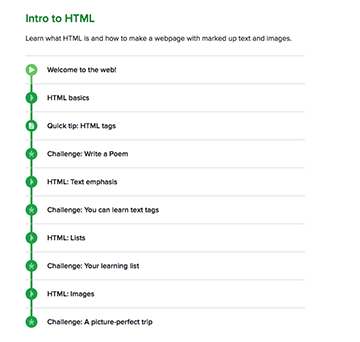

# Week 1 assignments

## Khanacademy Lessons
1. Sign up for http://khanacademy.org
1. Visit this lesson page: https://www.khanacademy.org/computing/computer-programming/html-css
1. Watch the videos and follow the exercises from *Intro to HTML* and *Intro to CSS*.
1. Post screenshots of your progress on Google Drive Week 1 folder. (the ones you watched will be filled with green.)
1. When you watch videos, take notes and follow along. Bring back any questions you have to next class.

*a screenshot like this!*

## Website analysis
Pick a website you often use and look at it from a different point of view this time. Critically examine the site on its structure, visual design and usability.

Find the structure (visible & invisible). Identify content hierarchy. See how the site presents information visually and see how easy it is to use. 

Identify design decisions that went into making the website more usable or less usable. - Does it have a clear or confusing structure? Does it have a good visual design that support the contents? What about the user interactions?

What is the purpose of visiting the website? and how is the structure and visual design helping the user achieve the goal?

What works and what does not work? If you were to make the same website, what would you change and why? 

- Submit as a written report in PDF format. Upload it on Google Drive Week 1 folder.
- Minimum 250 to maximum 500 words
- You may include screenshots/images.
- Be prepared to talk about your analysis to your peers next week.

------
All the assignments above are due before the beginning of next class.
