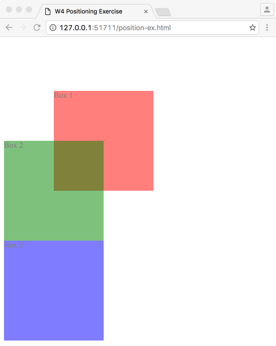
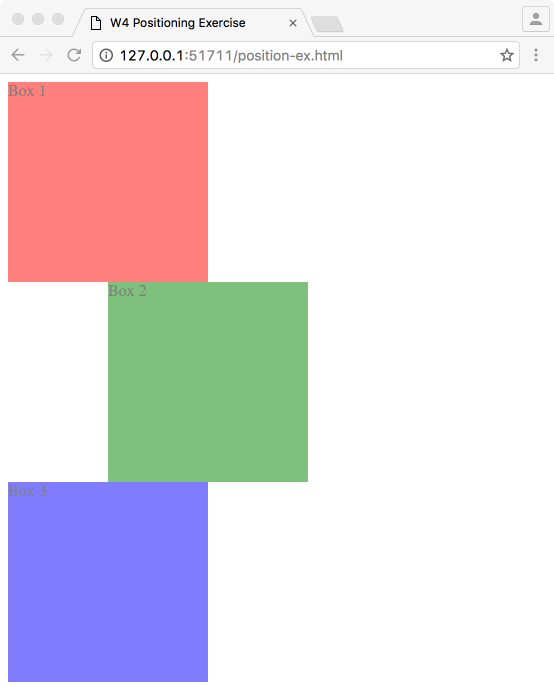
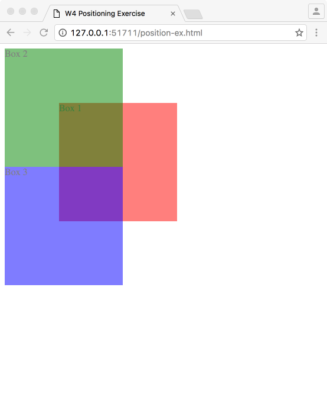
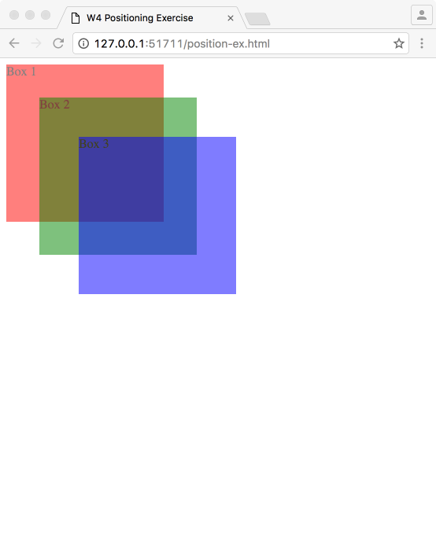

# CSS Layout: Position

CSS is used to visually style a webpage. It is relatively easy to style individual element such as font size, weight, color, because you can google for the right property name and its values and simply apply. But, laying out a page takes more planning as you will have to think about the structure and relationship among multiple elements.

There are multiple ways to design a layout using CSS. Here, we will look at `position` property. 

Below is a code template we will use for this posting, so let's set that up on [Codepen](http://codepen.io/cdaein/pen/zNgraq):
```html
<div class="box-1">box 1</div>
<div class="box-2">box 2</div>
<div class="box-3">box 3</div>
```
```css
div {
  box-sizing: border-box;
  background-color: lightgrey;
  margin: 20px;
  border: 1px solid black;
  width: 200px;
  height: 50px;
}
```

## Position property and its values
`position` property takes one of the four values, `static`, `relative`, `fixed` and `absolute`.

## static
This is the default positioning for any element, meaning you don't have to specify it because... it's default. With the position set to `static`, or by *not* specifying it, it will follow the regular document flow - from top to bottom and from left to right. If you want to move things around, then you will have to *position* with other values.

```css
div.box-1 {
  position: static;
}
```
Above will *not* have any effect on your box 1.

  
## relative
If you want to move your elements *relative* to its original position, use `position: relative;`. 

```css
div.box-2 {
  position: relative;
}
```

Setting the position to `relative` alone will not have any impact on the position of your element. After setting the position, you need to set the offset using `top`, `left`, `bottom` and/or `right`. For example, if you want to push your 2nd box 10px from left and 20px from top, you will set it like: 

```css
div.box-2 {
  position: relative;
  left: 10px;
  top: 40px;
}
```

Or, if you want to set the reference point from the right/bottom edges, then:

```css
div.box-2 {
  position: relative;
  bottom: 40px;
  right: 10px;
}
```

Use whichever method you feel more comfortable. They can also take negative values.

One more important thing to notice here is that, when I positioned the 2nd box, the boxes around it stay the same and they don't try to fill in any gaps. That's because when you set an element `relative`, it keeps its original space so that other elements cannot take it over. This is a big difference between `relative` and `absolute`.
  
## absolute
Let's change just one line from the previous styling:
```css
div.box-2 {
  position: absolute;
  bottom: 40px;
  right: 10px;
}
```
What just happened?! The box is now at the bottom-right corner of the page. When you set the position `absolute`, the element is positioned *relative* to its first *positioned* (not static) ancestor element. That's mouthful. To break it down, here is what happens. 

When you set the position absolute, first, your element will look at its parent whether it is *positioned* (any position value other than static). If the parent is not positioned, then it will go up the hierarchy and look at the parent of the parent element. It does so until it finds an ancestor that is positioned. Then, it will be relative to that ancestor element's position. What if it cannot find any positioned ancestors just like in our case here? Then, it will position itself relative to the entire document. That's why the box is now placed at the bottom-right corner.

As if this was not enough to make your head spin, there is one more important thing to know. Notice that when you position the box-2 absolute, it is taken out of the regular document flow, so the other elements can take up its original space.

### grouping things together
To make the box positioned relative to its positioned ancestor, change the code as below:
```html
<div class="box-1">box 1</div>
<div class="box-4">
  <div class="box-2">box 2</div>
</div>
<div class="box-3">box 3</div>
```

```css
div {
  box-sizing: border-box;
  background-color: lightgrey;
  margin: 20px;
  border: 1px solid black;
  width: 200px;
  height: 50px;
}

div.box-2 {
  position: absolute;
  bottom: 40px;
  right: 10px;
}

div.box-4 {
  position: relative;
}
```

Now, the parent of the box-2 is positioned relative, the box-2 will be positioned relative to the box-4, not the entire window. This is great because once you position all your elements relative to its other inside a parent, then, we can simply move the parent element, then, all the child elements will follow.
  
## fixed
To see what `fixed` position does, we will use a different code example.
```html
<div class="box-1">box 1</div>
<div class="box-2">box 2</div>
<div class="box-3">box 3</div>
```

```css
div {
  box-sizing: border-box;
  background-color: lightgrey;
  margin-bottom: 200px;
  border: 1px solid black;
  width: 400px;
  height: 150px;
}

div.box-2 {
  position: fixed;
  top: 100px;
  left: 100px;
}
```

`fixed` position works almost the same as `absolute` except that it does not scroll with other elements. Many websites use `fixed` positioning for the site navigation so that it is always visible, but it can cause some problems for mobile devices.

## Recap
- static: the default setting. don't worry about it.
- relative: relative to its original position. other elements will still honor the space.
- absolute: relative to the closest positioned ancestor. taken out of the regular document flow.
- fixed: same as absolute except that it does not scroll.


## Practice
See if you can recreate these compositions. What position value would you use?:






## Further learning
- [Don't Fear the Internet - Layout](https://vimeo.com/137320138)
- http://learn.shayhowe.com/html-css/positioning-content/
